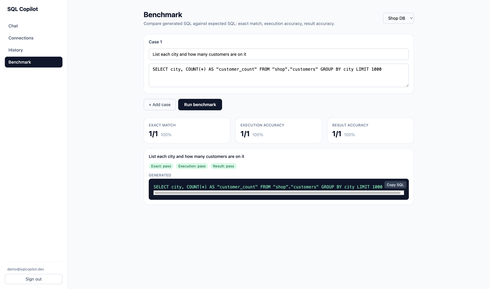
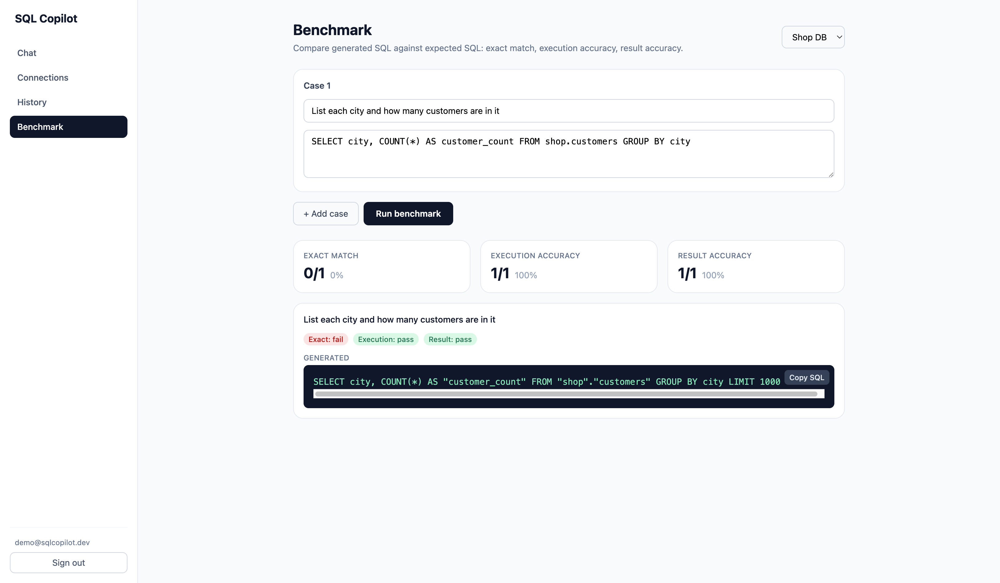

# SQL Copilot

An AI-powered data copilot: connect your own database, ask questions in natural
language, and get safe, validated, read-only SQL — generated, executed, and
self-healed automatically. Multi-tenant SaaS architecture from day one.

**Live demo:** https://ishaan28malik.github.io/sql-copilot/
· **API:** https://sqlcopilot-api-84lv.onrender.com

## Screenshots

**Ask your data** — natural language in, schema-aware SQL out, results rendered with copy/CSV:



**Benchmark** — compare generated SQL against expected SQL by exact match, execution accuracy, and result accuracy:



## Architecture

```
React SPA (GitHub Pages)
      │  Authorization: Bearer <token>   (CORS, cross-origin)
      ▼
Node API on Render  ── Hono + Drizzle + postgres.js
      │
      ├── Supabase Postgres (app data + pgvector schema embeddings)
      ├── HuggingFace Inference (Qwen2.5-7B chat + bge-small-en-v1.5 embeddings)
      ├── SQL validator (AST allowlist; optional SQLGlot microservice)
      └── Tenant databases (users' own PostgreSQL, read-only execution over TLS)
```

Ask pipeline: question → embed → pgvector retrieval of the relevant tables only
→ prompt → LLM → AST validation (reject anything but a single SELECT, inject a
row LIMIT) → execute in a `READ ONLY` transaction with `statement_timeout` →
self-heal on error (feed the DB error back to the model, up to 3 retries) →
results.

The API is written in [Hono](https://hono.dev/), which is runtime-portable. It
ships **two entry points** behind the same app:

- `src/server.ts` — Node (`@hono/node-server`). **This is what runs in
  production on Render.**
- `src/index.ts` — Cloudflare Workers (optional; see note below).

### Why Node/Render instead of Cloudflare Workers

The project was originally targeted at Cloudflare Workers. Workers turned out to
be the wrong fit for the core feature: **the Workers runtime cannot complete a
Postgres TLS handshake to arbitrary tenant databases.** Every Postgres driver
(`postgres.js` node build, `postgres.js` Cloudflare build, and `pg`) fails
identically inside `workerd`; Cloudflare Hyperdrive can rescue a *single*,
statically-configured database (the app's own), but you can't mint a Hyperdrive
config for every user's arbitrary database. Node connects to tenant Postgres
over TLS natively, so the API runs on Render. The Workers entry point and
`wrangler.toml` are retained only as an optional target for the app database.

## Repository layout

| Path | Purpose |
| --- | --- |
| `apps/web` | React + Vite + Tailwind + TanStack Query frontend (deployed to GitHub Pages) |
| `services/api` | Hono API: auth, connections, ask/execute, history, benchmark. `src/server.ts` (Node) + `src/index.ts` (Workers) |
| `services/ingestion` | Schema extraction/embedding library + standalone CLI reindexer |
| `services/sqlglot` | Optional Python FastAPI second-opinion validator (SQLGlot) |
| `packages/shared` | Types, zod schemas, Result, logger, AppError |
| `packages/ai` | `LlmProvider`/`EmbeddingProvider` contracts + HuggingFace and Ollama implementations |
| `packages/prompts` | SQL generation/repair prompts + completion parsing |
| `packages/database` | Drizzle schema, migrations, app-DB and tenant-DB clients |
| `packages/vector` | pgvector upsert + cosine-similarity retrieval |
| `render.yaml` | Render Blueprint for the Node API |

## API

| Endpoint | Description |
| --- | --- |
| `POST /auth/signup` `/auth/login` `/auth/logout`, `GET /auth/me` | Email/password auth; returns a bearer token (also sets a cookie) |
| `POST /connect-db` | Test, encrypt (AES-256-GCM), and save tenant credentials |
| `GET /connections`, `DELETE /connections/:id` | Manage connections |
| `POST /ingest-schema`, `POST /reindex` | Extract schema, embed, store in pgvector (ingestion fully replaces the index) |
| `GET /schema?connectionId=` | Indexed tables and their documents |
| `POST /ask` | NL → SQL → validate → execute → self-heal |
| `POST /execute` | Run user-edited SQL through the same validator/executor |
| `GET /history`, `GET /history/:id` | Conversations and messages |
| `POST /benchmark` | Exact-match / execution / result accuracy over test cases |

All routes except `/auth/*` and `/health` require an `Authorization: Bearer
<token>` header (the token is returned by signup/login).

## Authentication

The SPA and the API live on different origins (GitHub Pages ↔ Render), so
third-party **cookies** are unreliable (blocked by Safari/Firefox and
increasingly Chrome). Auth therefore uses a **bearer token**: signup/login
return a session token, the SPA stores it in `localStorage` and sends it as an
`Authorization` header. A session cookie is still set for same-origin/local
use. Tokens are stored server-side as SHA-256 hashes; passwords use PBKDF2.

## Safety model (defense in depth)

1. **AST allowlist** (`node-sql-parser`): exactly one statement, type must be
   SELECT; unparseable SQL is rejected (fails closed); a `tableList` authority
   check rejects non-select table access (e.g. data-modifying CTEs).
2. **Keyword denylist** on raw SQL (INSERT/UPDATE/DELETE/DROP/ALTER/TRUNCATE/
   CREATE/GRANT/…) as a backstop.
3. **Row cap**: LIMIT injected/clamped in the AST, re-enforced in the executor.
4. **Runtime backstop**: execution inside a `READ ONLY` transaction with
   `statement_timeout` — Postgres itself refuses writes even if something
   slipped through.
5. **Optional SQLGlot service**: independent Python parser as a second opinion
   (set `SQLGLOT_URL` to enable).
6. Credentials AES-256-GCM encrypted at rest; recommend a **read-only DB role**
   for connected databases anyway.

## AI provider

The model is abstracted behind `LlmProvider` / `EmbeddingProvider`
(`packages/ai`). Two implementations ship:

- **HuggingFace** (default in production): set `HF_TOKEN`. Chat via the
  OpenAI-compatible router (`Qwen/Qwen2.5-7B-Instruct`), embeddings via the
  feature-extraction pipeline (`BAAI/bge-small-en-v1.5`, 384-dim — matches the
  `pgvector` column).
- **Ollama** (self-hosted alternative): set `OLLAMA_URL` (and leave `HF_TOKEN`
  unset). Uses `qwen2.5:7b` + a 384-dim embedding model.

Selection happens in `services/api/src/lib/deps.ts`: HuggingFace when `HF_TOKEN`
is present, otherwise Ollama.

## Environment variables

| Var | Where | Notes |
| --- | --- | --- |
| `DATABASE_URL` | API | Supabase Postgres (session pooler, port 5432, `sslmode=require`) |
| `ENCRYPTION_KEY` | API | base64-encoded 32-byte key (`openssl rand -base64 32`) for AES-256-GCM |
| `HF_TOKEN` | API | HuggingFace access token with Inference Providers permission |
| `HF_CHAT_MODEL` / `HF_EMBED_MODEL` | API | default `Qwen/Qwen2.5-7B-Instruct` / `BAAI/bge-small-en-v1.5` |
| `OLLAMA_URL` | API | only if using Ollama instead of HuggingFace |
| `CORS_ORIGIN` | API | comma-separated allowed origins (the Pages URL) |
| `SQLGLOT_URL` | API | optional deep-validation microservice |
| `VITE_API_URL` | web | base URL of the API |

## Local development

```bash
pnpm install

# 1. App database (Supabase): create a project, then run migrations
DATABASE_URL="postgres://..." pnpm db:migrate    # enables pgvector + creates tables

# 2. API (Node)
cd services/api
cp .dev.vars.example .dev.vars    # DATABASE_URL, ENCRYPTION_KEY, HF_TOKEN, CORS_ORIGIN
PORT=3001 pnpm start              # http://localhost:3001  (Node server via tsx)
# or `pnpm dev` to run the Cloudflare Workers entry under wrangler

# 3. Web app
cd apps/web
cp .env.example .env              # VITE_API_URL=http://localhost:3001
pnpm dev                          # http://localhost:5173
```

Checks: `pnpm typecheck` · `pnpm test` (validator/crypto/prompt unit tests).

## Deployment

- **Frontend — GitHub Pages:** `cd apps/web && VITE_API_URL=<api-url> pnpm vite
  build --base=/sql-copilot/`, add `404.html` (SPA fallback) and `.nojekyll`,
  push the `dist/` to the `gh-pages` branch.
- **API — Render (Node):** create a service from `render.yaml` (Blueprint), set
  the secret env vars `DATABASE_URL`, `ENCRYPTION_KEY`, `HF_TOKEN` in the
  dashboard. Build installs pnpm via npm (Render's bundled corepack has stale
  signing keys) and requires Node ≥ 22.13.
- **Database — Supabase:** the migration enables the `vector` extension; use the
  session pooler URL (port 5432) for the API.
- **LLM — HuggingFace:** just an API token; no server to run. (Or self-host
  Ollama and set `OLLAMA_URL`.)

## Design decisions & deviations

- **Node/Render over Cloudflare Workers** — see the architecture note above:
  Workers can't do Postgres TLS to arbitrary tenant databases. The app stays
  runtime-portable (dual entry points).
- **HuggingFace over a self-hosted Ollama VM** — a hosted API needs no VM,
  tunnel, or session babysitting; the provider interface keeps Ollama as a
  drop-in alternative.
- **Bearer tokens over cookies** — cross-origin SPA ↔ API makes cookies
  unreliable.
- **SQLGlot** is Python and can't run in-process; it's an optional microservice
  behind the `SqlValidator` interface. The default `node-sql-parser` validator
  is authoritative.
- **`services/ingestion`** is a library + CLI, imported directly by the API
  (one deploy); the CLI covers very large schemas.
- **Self-healing** counts validation and execution failures alike: 1 initial
  attempt + up to 3 repairs (`QUERY_LIMITS.maxAttempts = 4`).
- **Multi-tenancy** is enforced at the query layer — every row carries
  `user_id`/`connection_id` and `getOwnedConnection` gates all tenant access.
- **MySQL** support: add a dialect entry in `packages/shared`, a driver in
  `packages/database/tenant.ts`, and an extractor variant — interfaces are
  already dialect-parameterized.

## Roadmap (pre-production hardening)

Rate limiting (especially on `/ask`), SSRF guards on `connect-db` (block private
IP ranges), enforced read-only DB roles, account management (email verify /
password reset), and monitoring/alerting.
